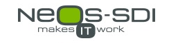

# Multi-Factor Authentication for Microsoft ADFS 2019/2016/2012r2 (with biometric authentication)
___

This project can help you to implement multi-factor authentication without requiring any additional provider.

You can download a fully functional solution or modify the source code to build your own solution.

MFA helps secure user sign-ins for on-premise or cloud services beyond just a single password. With MFA, users are required to enter a confirmation code, which is send to their phones, email account or via an authenticator application (Microsoft authentication, Google Authentication)after correctly entering their passwords.

**What I Know (password) and What I Hold (device) or What I Am (biometrics) are the keys of MFA.**

For example, if you user password is compromised by a hacker, he can’t activate your application (business email) because **You have** the code that can grant access to the app.

This extension, allow to use second factor with secondary email code transmission, or TOTP code (Time-based One Time Password) compatible with the Google’s (and others) standard. 

This extension works with Active Directory or an SQL Server Database for storing secret keys.

## Installation & Documentation
* <https://github.com/neos-sdi/adfsmfa/wiki/Home>
## Downloads
* <https://github.com/neos-sdi/adfsmfa/releases>
* <https://github.com/neos-sdi/adfsmfa/releases/download/3.0/adfsmfa.3.0.2012.0.msi>

___

Neos-SDI is a global business and technology consulting firm that leads organizations toward innovative growth faster through the identification, application and support of inspired technology solutions. By leveraging our unique methodologies, we are able to help our clients envision the unique ways technology can be successfully applied to their business. Our envisioning sessions are intended to inspire the use of technology in differentiated ways in order to optimize our client's potential for growth. Founded in Paris in 2001, the source of Neos-SDI’s success is attributed to over 150 certified consultants, and 14 gold and two silver Microsoft Partner competencies; making Neos-SDI one of the top 10 Microsoft Partners worldwide.

Feel free to follow our projects on github

Multi-Factor Authentication for ADFS (this one) : <https://github.com/neos-sdi/adfsmfa>

SharePoint Identity Service Application (Claim Provider for SharePoint 2013/2016) : <https://github.com/neos-sdi/spidentityservice>
___
## Features
* Localized UI French/English/Spanish/Italian/German/Dutch/Portuguese/Polish/Swedish/Romanian/Russian/Danish/Japanese, Quebec
* TOTP, Email, Phone, Biometric, Azure Providers for MFA
* Run with ADFS 2012 R2, 2016 and 2019
* Secret Keys length (Guid, 128, 256, 384 & 512 bytes) RNG generator
* Secret Keys RSA asymmetric encryption length (2048 bytes) RSA
* Secret Keys AES symmetric encryption length (512/1024) AES128, AES256
* Secret Keys custom encryption (when implementing ISecretKeyManager and ISecretKeyManagerActivator)
* Can use ADDS customizable attributes or SQL-Server Database, or develop a Custom Storage component
* Can send TOTP code by email (customizable template in resources)
* Can send TOTP code by sms (customizable and extensible with API)
* Can send TOTP code using Authenticator Apps like MS Authenticator, Google Authentication and more
* Biometric authentication (WebAuthN/FIDO2) (using component from Anders Åberg, Alex Seigler and others <https://github.com/abergs/fido2-net-lib> Great Work !)
* Enable self-registration
* Enable self-registration with QR code (using component from  George Mamaladze and his team <https://qrcodenet.codeplex.com> Great Work !)
* Enable custom change password.
* Can work with ADDS multi-forests with trust relationships
* Can work with LDAP 3.0 Providers (ADFS2016/2019) when using SQL Storage mode
* Full sample for Azure MFA (additional configuration tasks and costs implied)
* Developers can easily extend this component for other verification modes (Azure MFA, RSA,…) with the IExternalProvider, IExternalOTPProvider (deprecated), ISecretKeyManager interfaces
* Developers can easily extend this component for other storages modes (AD & SQL by default)
* Full support for ADFS 2019 themes

## Remarks
* Due to security, Developers must sign their Visual Studio Solution with a certificate .pfx
* You must deploy the solution on each of your ADFS servers, not on Proxy Servers.
* To work with ADDS, the ADFS Service account must have read and write to users properties (or use the superaccount feature).
* To work with SQL Server Database, you must deploy the database on a separate SQL Server (WID replication is supported (cached))
* Working with ADFS Windows server 2012r2, 2016 and 2019
